# ADR-007: Journal Entry Contract (LedgerTransaction)

## Status
Accepted (F6.1)

## Context
The financial core already persists journal data as `LedgerTransaction` + `LedgerEntry` with hash chaining ([ADR-001-ledger-sequence-id](ADR-001-ledger-sequence-id.md)) and transactional outbox ([ADR-003-transactional-outbox](ADR-003-transactional-outbox.md)). Product and Notion docs refer to `JournalEntry`; engineers need a single contract for invariants, naming, and posting rules before shipping `DisburseLoanCommand` (F6.2).

## Decision

### Naming
- **Business term**: Journal Entry (JE).
- **Persistence aggregate**: `LedgerTransaction` (table `LedgerTransactions`).
- **Lines**: `LedgerEntry` (table `LedgerEntries`).
- Renaming types/tables is deferred; the contract applies to `LedgerTransaction` as the canonical JE aggregate.

### Required fields (aggregate)
| Field | Purpose |
| --- | --- |
| `TenantId` | Tenant isolation |
| `Description` | Human-readable journal label |
| `ReferenceId` | Idempotency / external correlation (unique per tenant when set) |
| `Currency` | ISO-4217 for all lines |
| `EffectiveDate` | Business date of the entry |
| `Entries` | One or more debit/credit lines |
| `IsPosted` | Draft vs posted lifecycle |
| `IsReversal` | Marks compensating entries |
| `OriginalTransactionId` | Links reversal to source JE |
| `Sequence` | Per-tenant monotonic chain position (set on seal) |
| `Hash` / `PreviousHash` | Tamper-evident chain (set on seal) |

`CorrelationId` and `CausationId` are optional audit fields for distributed tracing.

### Invariants (enforced in domain)
1. **Double-entry balance**: `Sum(Debit - Credit) == 0` before `Post()`.
2. **Append-only after post**: No `AddEntry` once `IsPosted` or `Hash` is set.
3. **Seal is terminal**: `Seal()` assigns sequence/hash; no further mutation.
4. **Reversals are new JEs**: Never mutate a posted JE; use `CreateReversal` / `CreatePartialReversal` to emit a new balanced transaction with `IsReversal = true`.
5. **Partial reversal cap**: Refund amount cannot exceed remaining reversible principal on the original JE.

### Lifecycle

```mermaid
stateDiagram-v2
    [*] --> Draft: new LedgerTransaction
    Draft --> Draft: AddEntry
    Draft --> Posted: Post
    Posted --> Sealed: Seal
    Sealed --> [*]
    note right of Posted: Reversal JEs skip explicit Seal in domain tests;\nproduction uses FinancialPostingEngine.Seal
```

### Domain error codes
| Code | When |
| --- | --- |
| `ACCOUNTING.JOURNAL_UNBALANCED` | Post/Seal with non-zero net |
| `ACCOUNTING.JOURNAL_IMMUTABLE` | AddEntry after post/seal |
| `ACCOUNTING.REVERSAL_AMOUNT_EXCEEDED` | Partial reversal over limit |
| `ACCOUNTING.SYSTEM_ACCOUNT_LOCKED` | Mutating a system ledger account |

### Idempotency
- HTTP/command layer supplies `idempotencyKey` (guardrail: every write command).
- JE layer uses `ReferenceId` (e.g. `PAY-{paymentId}`) with a **unique index** on `(TenantId, ReferenceId)` where `ReferenceId IS NOT NULL`.

## Consequences
- **Pros**: Clear contract for F6.2+; domain tests lock invariants; aligns docs with existing implementation.
- **Cons**: Two names (Journal Entry vs LedgerTransaction) until a future rename migration.

## References
- [`Cobryx.Domain/Accounting/LedgerTransaction.cs`](../../../Cobryx.Domain/Accounting/LedgerTransaction.cs)
- [`Cobryx.Application/Accounting/Services/FinancialPostingEngine.cs`](../../../Cobryx.Application/Accounting/Services/FinancialPostingEngine.cs)
- [`ADR-008-standard-chart-of-accounts.md`](ADR-008-standard-chart-of-accounts.md)
