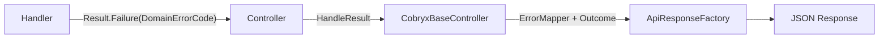

# Engineering Practices

This document defines the architectural conventions, error-handling patterns, and coding standards enforced across the Cobryx solution. All contributors must follow these practices to maintain consistency, type safety, and a predictable API contract.

## Table of Contents

- [Engineering Practices](#engineering-practices)
  - [Table of Contents](#table-of-contents)
  - [Error Handling Architecture](#error-handling-architecture)
  - [Result\<T\>](#resultt)
    - [Result Rules](#result-rules)
  - [DomainErrorCode](#domainerrorcode)
    - [Code Structure](#code-structure)
    - [Adding a New Code](#adding-a-new-code)
    - [Naming Conventions](#naming-conventions)
  - [Outcome](#outcome)
    - [Categories](#categories)
    - [Definition Pattern](#definition-pattern)
    - [Code Format](#code-format)
    - [Outcome Rules](#outcome-rules)
  - [Controller Pattern](#controller-pattern)
    - [Standard Action](#standard-action)
    - [HandleResult Behavior](#handleresult-behavior)
    - [Result Type Mapping](#result-type-mapping)
    - [Available Methods](#available-methods)
  - [Global Exception Handling](#global-exception-handling)
  - [Handler Pattern](#handler-pattern)
    - [Guard Clause Order](#guard-clause-order)
  - [Layer Boundaries](#layer-boundaries)
  - [Validation Responses](#validation-responses)
    - [Client-Facing Response](#client-facing-response)
    - [Implementation](#implementation)
    - [Validation Rules](#validation-rules)
  - [Anti-Patterns](#anti-patterns)
  - [New Feature Checklist](#new-feature-checklist)

---

## Error Handling Architecture

Cobryx uses three distinct types to communicate errors across architecture layers. Raw strings are never used.

| Type              | Layer                               | Purpose                                                                    |
| ----------------- | ----------------------------------- | -------------------------------------------------------------------------- |
| `DomainErrorCode` | Domain, Application, Infrastructure | Machine-readable, compiler-enforced error identity                         |
| `Outcome`         | API (Controllers, Outcomes)         | Semantic, client-facing result codes with categories                       |
| `Result<T>`       | All layers                          | Envelope carrying success/failure state and a `DomainErrorCode` on failure |



---

## Result\<T\>

`Result<T>` is the universal return type for commands and queries. The compiler enforces that only `DomainErrorCode` can be passed to failure paths.

**Correct usage:**

```csharp
return Result.Success(invoice.Id);
return Result.Failure<Guid>(DomainErrorCode.Customer.NotFound);
```

**The following will not compile:**

```csharp
return Result.Failure<Guid>("Customer not found");  // CS1503
```

### Result Rules

1. Never pass a raw string to `Result.Failure`. The compiler enforces this.
2. Never pass an `Outcome` to `Result.Failure`. Outcomes belong to the API layer only.
3. If a new error case appears, add a `DomainErrorCode` entry. Do not work around the type system.

---

## DomainErrorCode

A `sealed record` with a private constructor. Codes are organized by domain area using nested static classes.

### Code Structure

```csharp
AREA.ENTITY.ERROR_NAME
```

**Examples:**

```csharp
AUTH.TOKEN.INVALID
CUSTOMER.NOT_FOUND
TENANT.CONTEXT_MISSING
INVOICING.PAYMENT.ALREADY_PROCESSED
```

### Adding a New Code

Add the entry inside the relevant nested class in `DomainErrorCode.cs`:

```csharp
public static class Auth
{
    public static readonly DomainErrorCode ProviderNotSupported = new("AUTH.PROVIDER_NOT_SUPPORTED");
}
```

### Naming Conventions

| Suffix                                         | Meaning                    | HTTP Status (auto-mapped) |
| ---------------------------------------------- | -------------------------- | ------------------------- |
| `.NOT_FOUND`                                   | Resource does not exist    | 404                       |
| `.ALREADY_EXISTS` / `.DUPLICATE`               | Conflict                   | 409                       |
| `.BUSINESS_RULE_VIOLATION` / `.INVALID_STATUS` | Unprocessable entity       | 422                       |
| Other                                          | Default from `ErrorMapper` | Varies                    |

---

## Outcome

Outcomes are API-layer semantic codes that tell the frontend what happened. They include an `OutcomeCategory` for UI behavior and logging.

### Categories

| Category        | Meaning                            |
| --------------- | ---------------------------------- |
| `Success`       | Operation completed successfully   |
| `Info`          | Informational (e.g., MFA required) |
| `Warning`       | Non-blocking issue                 |
| `BusinessError` | Business rule violation            |
| `Critical`      | System failure                     |

### Definition Pattern

Outcomes are defined in `Cobryx.Api/Outcomes/` using a prefix constant:

```csharp
public static class AuthOutcomes
{
    private const string Prefix = "AUTH";

    public static readonly Outcome LoginCompleted = new(
        $"{Prefix}.USER.LOGIN_SUCCESS",
        OutcomeCategory.Success,
        "Login successful.");

    public static readonly Outcome LoginMfaRequired = new(
        $"{Prefix}.USER.LOGIN_MFA_REQUIRED",
        OutcomeCategory.Info,
        "MFA verification required.");
}
```

### Code Format

```csharp
PREFIX.ENTITY.ACTION_RESULT
```

**Examples:** `AUTH.USER.LOGIN_SUCCESS`, `BILLING.SUBSCRIPTION.CHECKOUT_CREATE_SUCCESS`

### Outcome Rules

1. Outcomes never appear in `Result.Failure`. They are for API responses only.
2. Every outcome module uses a `Prefix` constant.
3. Every outcome includes a `Description` for logging and documentation.
4. Use `Outcome.FromExternal()` sparingly, only for codes from external systems.

---

## Controller Pattern

All controllers extend `CobryxBaseController` and delegate response generation to `HandleResult`.

### Standard Action

```csharp
[HttpGet("{id}")]
public async Task<IActionResult> GetById(Guid id, CancellationToken ct)
{
    var result = await Sender.Send(new GetByIdQuery(id), ct);
    return HandleResult(result, MyOutcomes.Found);
}
```

### HandleResult Behavior

- **On success:** wraps the value in `ApiSuccessResponse` with the provided `Outcome`.
- **On failure:** maps `DomainErrorCode` via `ErrorMapper`, determines the HTTP status code, and generates an `ApiErrorResponse` with a derived failure `Outcome`.

### Result Type Mapping

When a `Result<T>` needs to be returned as a different response type:

```csharp
var mappedResult = result.IsSuccess
    ? Result.Success(new ResponseDto(result.Value!))
    : Result.Failure<ResponseDto>(result.Error!);

return HandleResult(mappedResult, MyOutcomes.Created);
```

### Available Methods

| Method                       | Use Case                           |
| ---------------------------- | ---------------------------------- |
| `HandleResult<T>`            | Standard command/query with data   |
| `HandleResult` (non-generic) | Commands that return no data       |
| `HandleDeleteResult`         | DELETE operations (204 on success) |
| `HandleCreatedResult<T>`     | POST operations (201 on success)   |
| `CreatedResult<T>`           | Direct 201 with data (no `Result`) |
| `Success<T>`                 | Direct 200 with data (no `Result`) |

---

## Global Exception Handling

`GlobalExceptionHandler` catches all unhandled exceptions and maps them to structured API responses.

| Exception Type                         | Mapped To                                                              |
| -------------------------------------- | ---------------------------------------------------------------------- |
| `CobryxException`                      | Its embedded `DomainErrorCode`                                         |
| `FluentValidation.ValidationException` | `DomainErrorCode.System.ValidationFailed` with structured field errors |
| Any other `Exception`                  | `DomainErrorCode.System.InternalError` (500)                           |

Exceptions produce `Outcome.FromExternal()` with `OutcomeCategory.Critical` for system failures or `OutcomeCategory.BusinessError` for validation and business errors.

---

## Handler Pattern

Every handler in the Application layer follows a consistent guard-clause pattern:

```csharp
public async Task<Result<Guid>> Handle(MyCommand request, CancellationToken ct)
{
    var tenantId = _tenantProvider.GetTenantId();
    if (!tenantId.HasValue)
        return Result.Failure<Guid>(DomainErrorCode.Tenant.ContextMissing);

    var entity = await _repository.GetByIdAsync(request.Id);
    if (entity == null)
        return Result.Failure<Guid>(DomainErrorCode.Entity.NotFound);

    entity.DoSomething();

    await _unitOfWork.SaveChangesAsync(ct);
    return Result.Success(entity.Id);
}
```

### Guard Clause Order

1. **Authentication** — `DomainErrorCode.Auth.NotAuthenticated`
2. **Tenant context** — `DomainErrorCode.Tenant.ContextMissing`
3. **Entity existence** — `DomainErrorCode.X.NotFound`
4. **Business rules** — Specific `DomainErrorCode` entries

---

## Layer Boundaries

Each layer has strict rules about which types it may use:

| Layer                            | Uses                                 | Never Uses                      |
| -------------------------------- | ------------------------------------ | ------------------------------- |
| API (Controllers, Outcomes)      | `Outcome`, `HandleResult`            | Raw strings, `DomainException`  |
| Application (Handlers, Queries)  | `Result<T>`, `DomainErrorCode`       | `Outcome`, `HttpContext`        |
| Domain (Entities, Value Objects) | `DomainException`, `DomainErrorCode` | `Result`, `Outcome`, HTTP types |
| Infrastructure (Services, Repos) | `Result<T>`, `DomainErrorCode`       | `Outcome`, Controllers          |

---

## Validation Responses

The frontend translates error codes. Human-readable messages exist for internal logging and debugging but are never serialized to the client.

### Client-Facing Response

```json
{
  "success": false,
  "errors": [
    { "field": "email", "code": "VALIDATION.CUSTOMER.EMAIL.INVALID_FORMAT" },
    { "field": "phone", "code": "VALIDATION.CUSTOMER.PHONE.REQUIRED" }
  ]
}
```

### Implementation

The `ValidationError` record includes a `Message` property marked with `[JsonIgnore]`:

```csharp
public record ValidationError(string Field, string Code, string? Message = null)
{
    [JsonPropertyName("field")]  public string Field { get; init; } = Field;
    [JsonPropertyName("code")]   public string Code { get; init; } = Code;
    [JsonIgnore]                 public string? Message { get; init; } = Message;
}
```

Messages are populated in code for internal observability but excluded from serialization.

### Validation Rules

1. `Message` is always `[JsonIgnore]`. It exists for logs, never for the client.
2. FluentValidation `ErrorMessage` is kept for internal debugging via `ValidationError.Message`.
3. Every validator must use `.WithErrorCode(...)` from the `*ValidationErrors` constants.
4. The `ValidationCode` record carries an optional `Message` for internal documentation.

---

## Anti-Patterns

| Anti-Pattern                                  | Correct Pattern                                  |
| --------------------------------------------- | ------------------------------------------------ |
| `Result.Failure("Not found")`                 | `Result.Failure(DomainErrorCode.X.NotFound)`     |
| `return BadRequest(...)` in a controller      | `return HandleResult(result, outcome)`           |
| Using `Outcome` in the Application layer      | `Outcome` is API-layer only                      |
| Catching `DomainException` in a controller    | Let `GlobalExceptionHandler` handle it           |
| Creating ad-hoc error strings                 | Add to `DomainErrorCode` first                   |
| `result.Error ?? someOutcome` in a controller | `result.Error!` (guaranteed non-null on failure) |
| Serializing `message` in validation errors    | Frontend translates codes; use `[JsonIgnore]`    |

---

## New Feature Checklist

- [ ] Define `DomainErrorCode` entries for all failure cases
- [ ] Define `Outcome` entries in `Cobryx.Api/Outcomes/` for all API responses
- [ ] Use `Result<T>` as the return type for all handlers
- [ ] Use `HandleResult` in the controller; never build responses manually
- [ ] Guard clauses follow the standard order (Auth, Tenant, Entity, Business)
- [ ] All Outcomes include a `Description` for logging
- [ ] `OutcomeCategory` is semantically correct
- [ ] No raw strings anywhere in the failure path
- [ ] Validation errors use codes only; `message` is `[JsonIgnore]`
