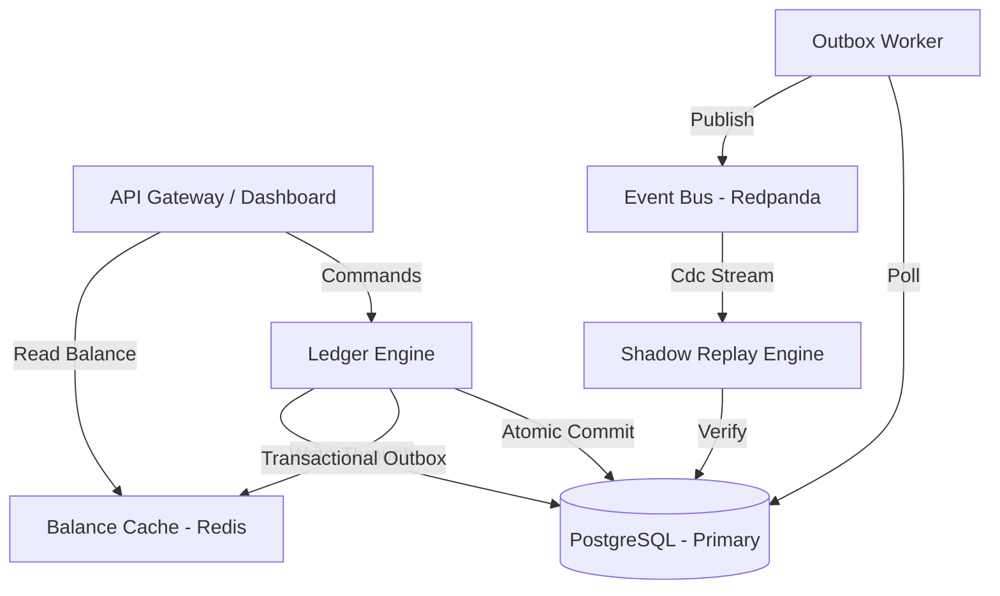

# Infrastructure Overview

Global architecture of the Cobryx Financial Infrastructure.

## Component Roles
- **Ledger Engine**: Core business logic and transactional integrity.
- **Outbox Worker**: Reliable event dispatcher with retry logic.
- **Redpanda (Kafka)**: Distributed log for all financial mutations.
- **Shadow Replay Engine**: Continuous independent auditor for drift detection.
- **Redis**: High-performance materialized view for financial state.
