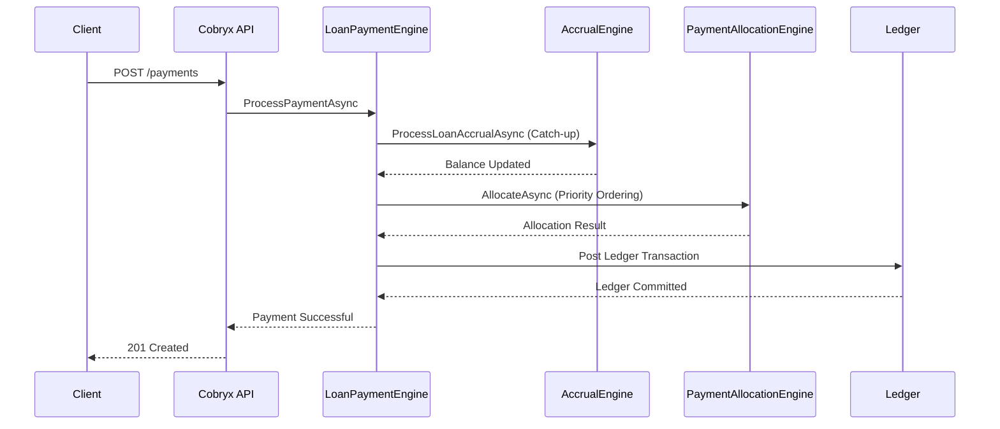
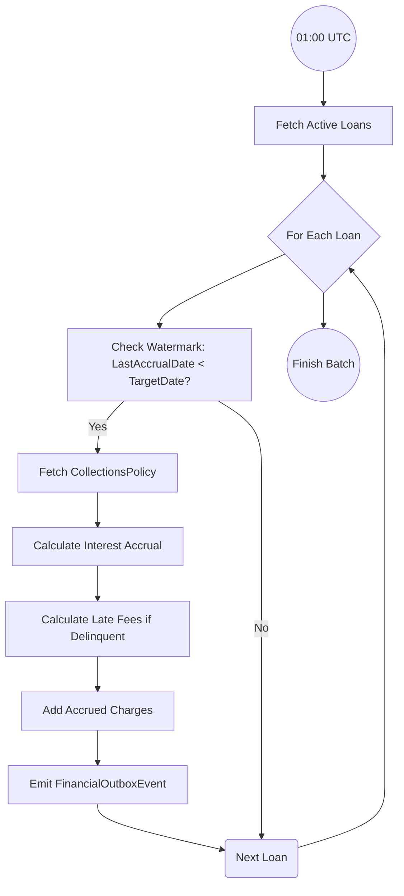

# Financial Flows

Detailing the core transactional logic for payments and accruals.

## 1. Payment Allocation Flow (Sequence)

```mermaid
sequenceDiagram
    participant C as Client
    participant API as Cobryx API
    participant LPS as LoanPaymentEngine
    participant AE as AccrualEngine
    participant PAE as PaymentAllocationEngine
    participant L as Ledger

    C->>API: POST /payments
    API->>LPS: ProcessPaymentAsync
    LPS->>AE: ProcessLoanAccrualAsync (Catch-up)
    AE-->>LPS: Balance Updated
    LPS->>PAE: AllocateAsync (Priority Ordering)
    PAE-->>LPS: Allocation Result
    LPS->>L: Post Ledger Transaction
    L-->>LPS: Ledger Committed
    LPS-->>API: Payment Successful
    API-->>C: 201 Created
```

## 2. Accrual Engine Logic (Loop)

```mermaid
graph TD
    Start((01:00 UTC)) --> GetLoans[Fetch Active Loans]
    GetLoans --> Loop{For Each Loan}
    Loop --> CheckWatermark[Check Watermark: LastAccrualDate < TargetDate?]
    CheckWatermark -->|Yes| CheckPolicy[Fetch CollectionsPolicy]
    CheckPolicy --> Interest[Calculate Interest Accrual]
    Interest --> LateFees[Calculate Late Fees if Delinquent]
    LateFees --> Post[Add Accrued Charges]
    Post --> Outbox[Emit FinancialOutboxEvent]
    Outbox --> Next(Next Loan)
    Next --> Loop
    Loop --> End((Finish Batch))
    CheckWatermark -->|No| Next
```
