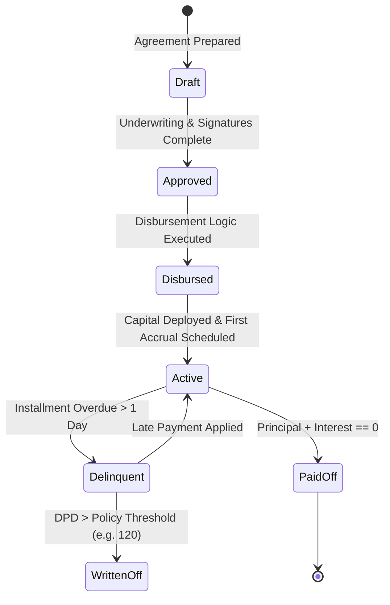

# Loan Lifecycle

Visual representation of the Loan State Machine in Cobryx.

```mermaid
stateDiagram-v2
    [*] --> Draft: Agreement Prepared
    Draft --> Approved: Underwriting & Signatures Complete
    Approved --> Disbursed: Disbursement Logic Executed
    Disbursed --> Active: Capital Deployed & First Accrual Scheduled
    Active --> Delinquent: Installment Overdue > 1 Day
    Delinquent --> Active: Late Payment Applied
    Delinquent --> WrittenOff: DPD > Policy Threshold (e.g. 120)
    Active --> PaidOff: Principal + Interest == 0
    PaidOff --> [*]
```
